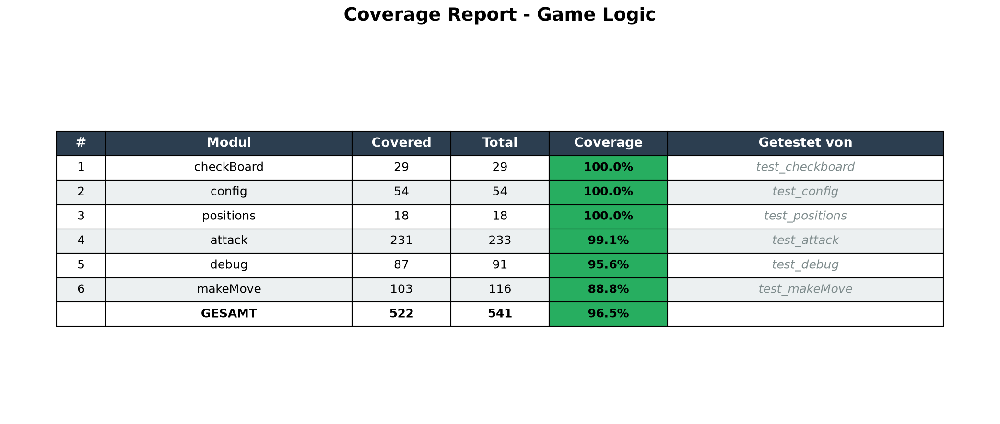

Hier ist eine umfassende README.md für dein Tablut-Projekt:

---

# ♟️ Tablut - KI-Strategiespiel

##  Überblick

Tablut ist ein altes skandinavisches Strategiespiel, das auf einem 9×9-Brett gespielt wird. Zwei Spieler übernehmen unterschiedliche Rollen:

- **Weiß (Angreifer)**: Versucht den weißen König sicher auf eines der vier Eckfelder zu bringen.
- **Schwarz (Verteidiger)**: Versucht den König zu umzingeln und zu schlagen.

Dieses Projekt implementiert eine vollständige Tablut-Spiel-Engine mit verschiedenen KI-Algorithmen, die gegeneinander antreten können.

---

##  Installation

### 1. Repository klonen

```bash
git clone <repository-url>
cd Tablut
```

### 2. Virtuelle Umgebung erstellen (empfohlen)

```bash
# Virtuelle Umgebung erstellen
python -m venv venv

# Virtuelle Umgebung aktivieren
# Windows:
venv\Scripts\activate
# macOS/Linux:
source venv/bin/activate
```

### 3. Abhängigkeiten installieren

```bash
pip install -r requirements.txt
```

Die wichtigsten Abhängigkeiten sind:
- `numpy` - für effiziente Berechnungen
- `matplotlib` - für Visualisierungen (optional)
- `tomli` - für Konfigurationsdateien (optional)

---

##  Spielen gegen die KI

### Einzelner KI-Durchlauf

Der einfachste Weg, eine KI spielen zu sehen:

```bash
# In das Tablut-Verzeichnis wechseln
cd Tablut

# Hauptprogramm ausführen
python src/main.py
```

**Was passiert?**
- Du siehst das Startboard
- Die KI führt Zug für Zug aus
- Jeder Zug wird mit Informationen wie Zeit, Suchtiefe und Eval-Aufrufen angezeigt
- Am Ende wird der Gewinner verkündet

### KI vs KI - Match

Für einen direkten Vergleich zweier KI-Engines:

```bash
# Match zwischen zwei KIs
python src/match_example.py
```

**Konfiguration anpassen:**

Öffne `src/match_example.py` und ändere die Einstellungen am Anfang der Datei:

```python
# Welche Engine spielt als Schwarz?
BLACK_ENGINE = "AB_TT"           # Alpha-Beta mit Transposition Table

# Welche Engine spielt als Weiß?
WHITE_ENGINE = "AB_TT_PVS"       # Alpha-Beta mit Transposition Table + PVS

# Maximale Suchtiefe für Alpha-Beta-Engines
MAX_DEPTH = 4

# Bedenkzeit pro Spieler in Sekunden
TIME_LIMIT = 60

# Soll das Board nach jedem Zug angezeigt werden?
SHOW_EVERY_MOVE = True
```

**Verfügbare Engines:**

| Kürzel | Engine | Beschreibung |
|--------|--------|--------------|
| `AB` | Alpha-Beta | Einfache Alpha-Beta-Suche |
| `AB_TT` | Alpha-Beta mit Transposition Table | Speichert bereits berechnete Stellungen |
| `AB_TT_PVS` | Alpha-Beta mit PVS | Zusätzlich Principal Variation Search |
| `MCTS` | Monte-Carlo-Tree-Search | Simuliert viele zufällige Partien |

---

##  Match-Serien

Für statistisch aussagekräftige Vergleiche mehrerer Engines:

```bash
# Führt eine Serie von Matches zwischen verschiedenen Engines durch
python src/gewinnrate.py
```

Die Ergebnisse zeigen:
- Siegquote jeder Engine
- Remis-Rate
- Detaillierte Statistiken

---

##  Projektstruktur

```
Tablut/
├── src/
│   ├── gamelogic/              # Spiel-Logik
│   │   ├── attack.py           # Schlag-Regeln
│   │   ├── checkBoard.py       # Spielstand-Prüfung
│   │   ├── config.py           # Globale Konfiguration
│   │   ├── debug.py            # Debug-Funktionen
│   │   ├── evaluateFunction.py # Bewertungsfunktion
│   │   ├── makeMove.py         # Zug-Generierung
│   │   ├── positions.py        # Figuren-Positionen
│   │   └── saveBoardState.py   # Zustand speichern/wiederherstellen
│   │
│   ├── models/                 # KI-Engines
│   │   ├── alphaBeta.py        # Basis Alpha-Beta
│   │   ├── alphaBetaWithTransposition.py
│   │   ├── alphaBetaWithPVS.py
│   │   ├── MCTS.py             # Monte-Carlo-Tree-Search
│   │   ├── MCTS_UCT.py         # MCTS + UCB
│   │   └── MCTS_UCT_PB.py      # MCTS + UCB + Progressive Bias
│   │
│   ├── main.py                 # Einzelner KI-Durchlauf
│   ├── match_example.py        # KI vs KI Match
│   └── gewinnrate.py           # Match-Serien
│
├── tests/                      # Unit-Tests
│   ├── test_attack.py
│   ├── test_checkboard.py
│   ├── test_makeMove.py
│   └── ...
│
├── requirements.txt            # Abhängigkeiten
└── README.md                   # Diese Datei
```

---

## 🎯 Spielregeln (Kurzfassung)

### Ziel
- **Weiß**: König auf eines der 4 Eckfelder bringen → Weiß gewinnt
- **Schwarz**: König schlagen → Schwarz gewinnt

### Figuren
- **K** = König (weiß) – startet auf dem Thron (4,4)
- **W** = Weißer Bauer
- **B** = Schwarzer Bauer

### Besondere Felder
- **Thron** (4,4) – startet der König
- **Ecken** (0,0), (0,8), (8,0), (8,8) – Siegfelder für Weiß

### Schlagregeln
- Eine Figur wird geschlagen, wenn sie zwischen zwei gegnerischen Figuren steht
- Der König muss von allen 4 Seiten umzingelt sein, um geschlagen zu werden

### Remis-Bedingungen
- 50 Züge ohne Figurenverlust
- 3-fache Stellungswiederholung

---

##  Tests ausführen

```bash
# Alle Tests ausführen
python -m unittest discover tests

# Spezifischen Test ausführen
python -m unittest tests.test_attack
```

**Test-Abdeckung:**



---

## 🖥️ Beispiel-Ausgabe

```
======================================================================
TABLUT - KI-VERGLEICH
======================================================================
Konfiguration:
  Schwarz: AB_TT
  Weiß:    AB_TT_PVS
  Tiefe:   4
  Zeit:    60s
======================================================================

STARTBOARD:
   0  1  2  3  4  5  6  7  8
 0  0  0  0  B  B  B  0  0  0
 1  0  0  0  0  B  0  0  0  0
 2  0  0  0  0  W  0  0  0  0
 3  B  0  0  0  W  0  0  0  B
 4  B  B  W  W  K  W  W  B  B
 5  B  0  0  0  W  0  0  0  B
 6  0  0  0  0  W  0  0  0  0
 7  0  0  0  0  B  0  0  0  0
 8  0  0  0  B  B  B  0  0  0

Weiße Figuren: 9, Schwarze Figuren: 16, König: 1

------------------------------------------------------------
Zug 1: Black (AB_TT) am Zug
------------------------------------------------------------
  Von: (3, 0)  →  Nach: (3, 1)
  Zeit: 0.234s
  Suchtiefe: 4
  Eval-Aufrufe: 1234

Board nach Zug 1:
   ...

======================================================================
SPIEL BEENDET!
======================================================================
🏆  WEISS GEWINNT!
Anzahl Züge: 42
Spieldauer: 45.67s
======================================================================
```

---

## 🤝 Beitrag / Entwicklung

### Code-Stil
- PEP 8 konform
- Docstrings für alle Funktionen

### Neue Engine hinzufügen
1. Erstelle eine neue Datei in `src/models/`
2. Implementiere `iterative_deepening(board, onTurn, time_limit, max_depth)`
3. Füge die Engine zur Factory in `match_example.py` und `gewinnrate.py` hinzu

---

## 📚 Literatur / Quellen

- [Tablut Regeln](https://en.wikipedia.org/wiki/Tablut)
- [Alpha-Beta Pruning](https://en.wikipedia.org/wiki/Alpha%E2%80%93beta_pruning)
- [Monte-Carlo-Tree-Search](https://en.wikipedia.org/wiki/Monte_Carlo_tree_search)
- [Principal Variation Search](https://en.wikipedia.org/wiki/Principal_variation_search)

---

## 👥 Autoren

- Mohammad Bilal Butt - *Implementierung & KI-Engines & Spiel-Logik & Tests*
- Lovejit Singh Gotra - *Implementierung & Spiel-Logik *

---

## 🐛 Fehler melden

Bei Fragen oder Problemen bitte ein Issue auf GitHub erstellen.

---

## 📞 Kontakt

- Email: [deine-email@example.com]
- GitHub: [https://github.com/dein-profil]

---

**Viel Spaß beim Spielen und Experimentieren!** 🎲